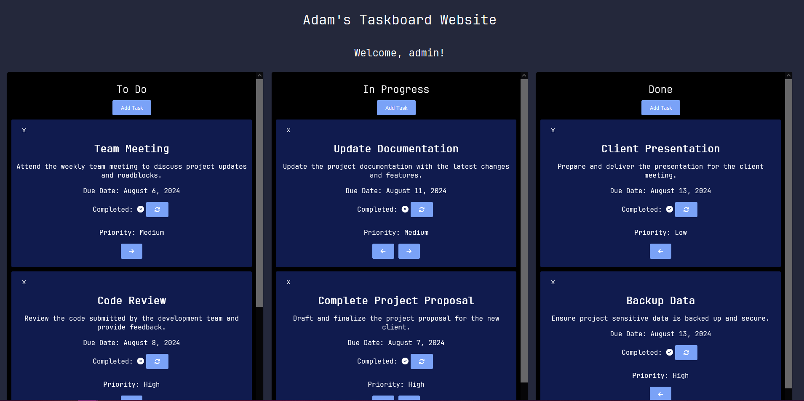
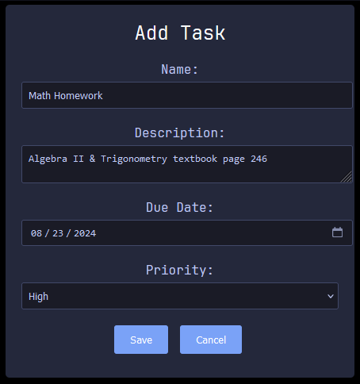
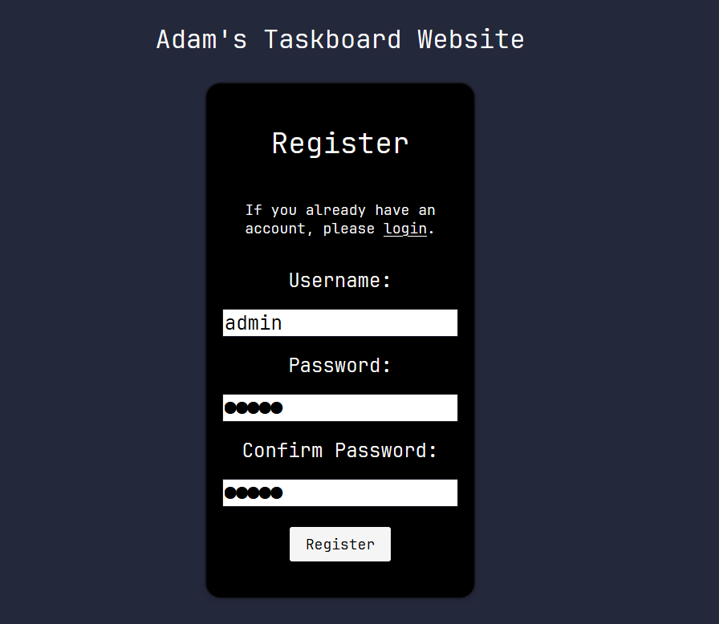
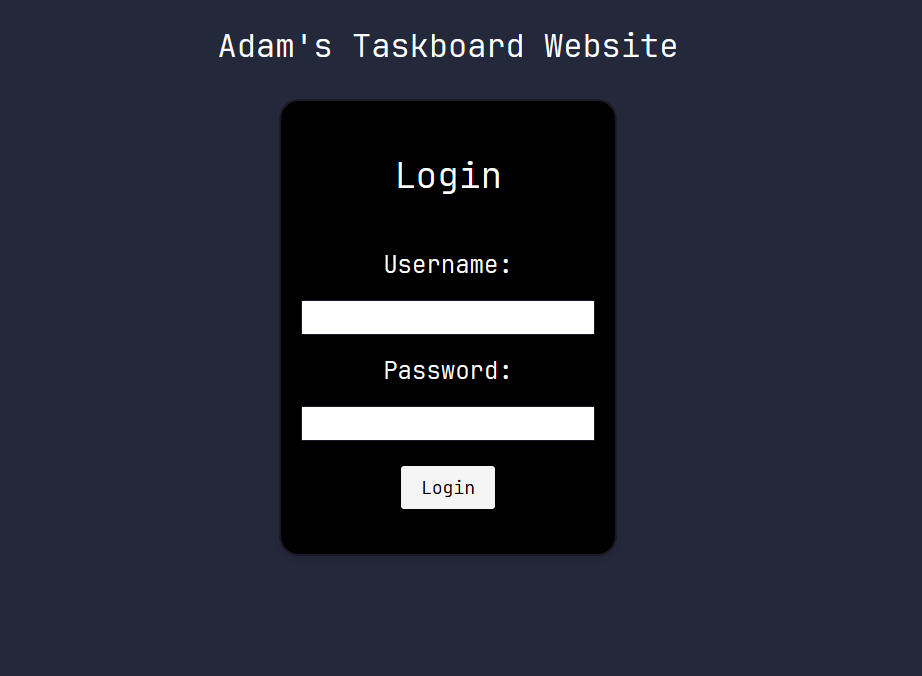

# Description of Architecture
This is a full-stack Node.js application. 

The backend is a RESTful API communicating with a containerized instance of MongoDB using ExpressJS and Mongoose, you can view the source code [here](https://github.com/attiaa1/taskboard-api). User authentication is included via JWT (JSON Web Tokens) and passwords are hashed prior to checking them into the database via a generated 64-bit Hexidecimal secret for proper handling of sensitive information.  

The frontend is done via ReactJS and is the source code on the repository you are seeing now. The infrastructure handling all requests is done using the fetch library. All other user interface you interact with is handled via components, the most involved being the Dashboard, HTML and CSS.  

# Demonstration
## Dashboard full of sample events

## GUI for adding a task

## Registration and Login Screens

